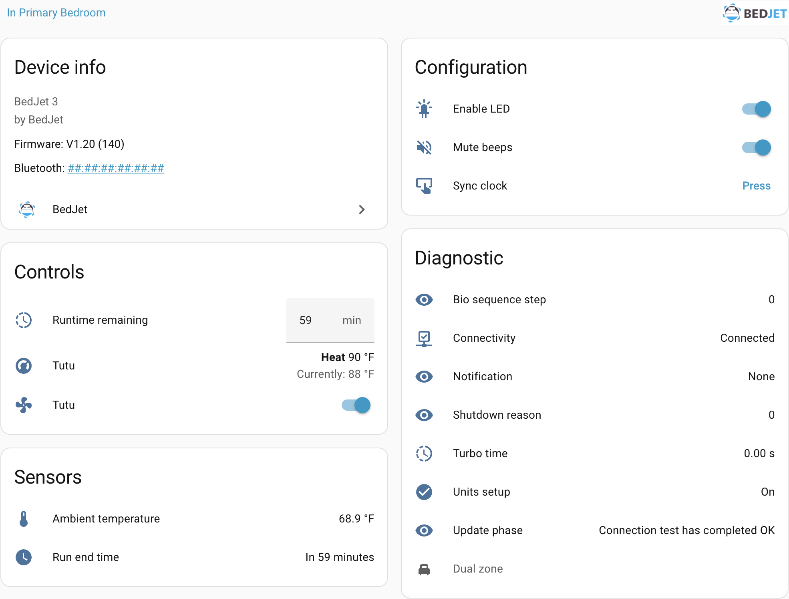

<!-- BEGIN AUTO-GENERATED HEADER -->

<!-- END AUTO-GENERATED HEADER -->

<picture>
  <source media="(prefers-color-scheme: dark)" srcset="https://brands.home-assistant.io/bedjet/dark_logo.png">
  
</picture>

# BedJet for Home Assistant

This project provides various entities to allow control of a [BedJet 3](https://bedjet.com) device.

> ⚠️ **Important**
>
> BedJet devices only allow **one active Bluetooth connection at a time**. If the BedJet mobile app is open (or running in the background) and connected to the device, Home Assistant will not be able to connect to it. The BedJet remote is not affected by this limitation, as it uses RF rather than Bluetooth.
>
> Before proceeding, **make sure the BedJet app is fully closed**. If you need to use the app (for example, to adjust biorhythm programs), temporarily disable the Home Assistant integration.

<!-- BEGIN AUTO-GENERATED INSTALLATION -->

## ⬇️ Installation

### HACS (Recommended)

To download:

This integration is available in the default [HACS](https://hacs.xyz/) repository.

1. Use the **My Home Assistant** badge above, or from within Home Assistant, click on **HACS**
2. Search for `BedJet` and click on the appropriate repository
3. Click **DOWNLOAD**
4. Restart Home Assistant

### Manual

If you prefer manual installation:

1. Download or clone this repository
2. Copy the `custom_components/bedjet` folder to your Home Assistant `custom_components` directory. If this is your first custom component, you may need to create the directory.  
   Example paths:
   - Hassio: `/config/custom_components`
   - Hassbian: `/home/homeassistant/.homeassistant/custom_components`
3. Restart Home Assistant

> ⚠️ Manual installation will not provide automatic update notifications. HACS installation is recommended unless you have a specific need.

## ➕ Setup

Once installed, you can setup the integration by clicking on the following badge:

Alternatively:

1. Go to [Settings > Devices & services](https://my.home-assistant.io/redirect/integrations/)
2. In the bottom-right corner, select **Add integration**
3. Type `BedJet` and select the **BedJet** integration
4. Follow the instructions to add the integration to your Home Assistant
<!-- END AUTO-GENERATED INSTALLATION -->

## Screenshot

<!-- BEGIN AUTO-GENERATED FOOTER -->

## ❤️ Support Me

I maintain this Home Assistant integration in my spare time. If you find it useful, consider supporting development:

- 💜 [Sponsor me on GitHub](https://github.com/sponsors/natekspencer)
- ☕ [Buy me a coffee / beer](https://ko-fi.com/natekspencer)
- 💸 [PayPal (direct support)](https://www.paypal.com/paypalme/natekspencer)
- ⭐ [Star this project](https://github.com/natekspencer/ha-bedjet)
- 📦 If you’d like to support in other ways, such as donating hardware for testing, feel free to [reach out to me](https://github.com/natekspencer)

## 📈 Star History

<!-- END AUTO-GENERATED FOOTER -->
